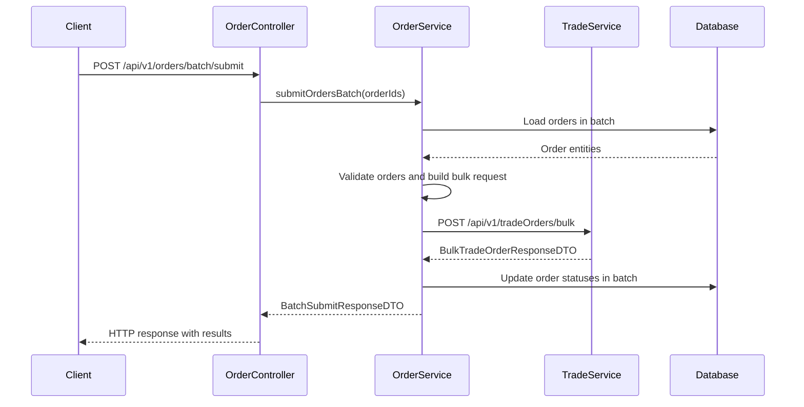

# Design Document

## Overview

This design implements bulk order submission to the trade service by replacing the current individual order processing approach with a single bulk API call. The enhancement will significantly improve performance by eliminating the overhead of multiple HTTP requests while maintaining the existing API contract and ensuring proper error handling.

The current implementation processes orders individually in a loop, calling the trade service once per order. This creates substantial overhead and performance bottlenecks. The trade service provides a bulk endpoint (`POST /api/v1/tradeOrders/bulk`) that accepts up to 1000 orders in a single atomic transaction, which will dramatically reduce processing time and system overhead.

## Architecture

### Current Architecture Issues

The existing `submitOrdersBatch` method in `OrderService` has several performance problems:

1. **Individual Processing Loop**: Processes each order separately with `submitIndividualOrderInTransaction`
2. **Multiple HTTP Calls**: Makes one HTTP request per order to the trade service
3. **Database Connection Overhead**: Uses semaphores and individual transactions for each order
4. **Complex Reservation Logic**: Implements atomic reservation with negative order IDs to prevent race conditions
5. **Inefficient Status Updates**: Updates order status individually after each trade service call

### New Bulk Architecture

The new design will:

1. **Single Bulk Request**: Collect all valid orders and send them in one HTTP request
2. **Batch Database Operations**: Load orders in batch, update statuses in batch
3. **Simplified Transaction Management**: Use fewer, more efficient transactions
4. **Maintain API Contract**: Keep the same request/response format for clients

### Component Interaction Flow



## Components and Interfaces

### Modified OrderService Methods

#### 1. Enhanced submitOrdersBatch Method

```java
public BatchSubmitResponseDTO submitOrdersBatch(List<Integer> orderIds) {
    // 1. Load and validate orders in batch
    List<Order> validOrders = loadAndValidateOrdersForBulkSubmission(orderIds);
    
    // 2. Build bulk request
    BulkTradeOrderRequestDTO bulkRequest = buildBulkTradeOrderRequest(validOrders);
    
    // 3. Call trade service bulk endpoint
    BulkTradeOrderResponseDTO tradeServiceResponse = callTradeServiceBulk(bulkRequest);
    
    // 4. Update order statuses in batch
    updateOrderStatusesFromBulkResponse(validOrders, tradeServiceResponse);
    
    // 5. Transform response to match existing API contract
    return transformBulkResponseToOrderServiceFormat(tradeServiceResponse, orderIds);
}
```

#### 2. New Supporting Methods

- `loadAndValidateOrdersForBulkSubmission(List<Integer> orderIds)`: Load orders and validate they're in NEW status
- `buildBulkTradeOrderRequest(List<Order> orders)`: Convert orders to trade service bulk format
- `callTradeServiceBulk(BulkTradeOrderRequestDTO request)`: Make single HTTP call to bulk endpoint
- `updateOrderStatusesFromBulkResponse(List<Order> orders, BulkTradeOrderResponseDTO response)`: Update order statuses based on results
- `transformBulkResponseToOrderServiceFormat(BulkTradeOrderResponseDTO response, List<Integer> orderIds)`: Convert trade service response to order service format

### New DTOs (if needed)

The trade service already provides the necessary DTOs:
- `BulkTradeOrderRequestDTO`: Contains `tradeOrders` array
- `BulkTradeOrderResponseDTO`: Contains status, message, counts, and results array
- `TradeOrderResultDTO`: Individual result with requestIndex, status, message, and tradeOrder

## Data Models

### Order Entity Validation

Orders must meet these criteria for bulk submission:
- Status must be "NEW"
- All required fields must be present (portfolioId, securityId, quantity, limitPrice, etc.)
- Order must not already have a tradeOrderId

### Bulk Request Structure

```json
{
  "tradeOrders": [
    {
      "orderId": 12345,
      "portfolioId": "PORTFOLIO_001",
      "orderType": "BUY",
      "securityId": "AAPL",
      "quantity": 100.00,
      "limitPrice": 150.25,
      "tradeTimestamp": "2024-01-15T10:30:00Z",
      "blotterId": 1
    }
  ]
}
```

### Response Transformation

The trade service bulk response must be transformed to match the existing order service API:

**Trade Service Response** → **Order Service Response**
- `BulkTradeOrderResponseDTO` → `BatchSubmitResponseDTO`
- `TradeOrderResultDTO` → `OrderSubmitResultDTO`
- Map `requestIndex` to original order position
- Extract `tradeOrder.id` as the trade order ID for successful submissions

## Error Handling

### Trade Service Error Scenarios

1. **Complete Success (HTTP 201)**: All orders processed successfully
   - Update all order statuses to "SENT"
   - Set tradeOrderId for each order
   - Return success response

2. **Complete Failure (HTTP 400/500)**: All orders failed
   - Log detailed error information
   - Return failure response with error details
   - Do not update any order statuses

3. **Partial Success**: Some orders succeeded, others failed (if supported by trade service)
   - Update successful orders to "SENT" status
   - Leave failed orders in "NEW" status
   - Return partial success response

### Error Logging Requirements

As specified in the requirements, log comprehensive error details:

```java
logger.error("Trade service bulk submission failed: status={}, response={}, orderIds={}, error={}", 
    response.getStatusCode(), response.getBody(), orderIds, e.getMessage(), e);
```

### Validation Error Handling

- **Invalid Order Status**: Orders not in "NEW" status are excluded from bulk request
- **Missing Orders**: Order IDs that don't exist are reported as failures
- **Already Processed**: Orders with existing tradeOrderId are reported as failures

## Testing Strategy

### Unit Tests

1. **Bulk Request Building**: Test conversion from Order entities to BulkTradeOrderRequestDTO
2. **Response Transformation**: Test conversion from trade service response to order service format
3. **Error Handling**: Test various error scenarios and logging
4. **Validation Logic**: Test order validation and filtering

### Integration Tests

1. **Successful Bulk Submission**: Test complete success scenario
2. **Trade Service Errors**: Test handling of various HTTP error responses
3. **Mixed Results**: Test scenarios with both valid and invalid orders
4. **Performance Comparison**: Measure performance improvement vs. individual submission

### Test Data Requirements

- Orders in various statuses (NEW, SENT, etc.)
- Orders with missing required fields
- Orders with existing tradeOrderIds
- Large batches (up to 100 orders) for performance testing

## Performance Considerations

### Expected Performance Improvements

1. **Reduced HTTP Overhead**: Single request instead of N requests
2. **Fewer Database Transactions**: Batch operations instead of individual transactions
3. **Eliminated Semaphore Contention**: No need for complex concurrency control
4. **Simplified Logic**: Remove atomic reservation and complex state management

### Database Optimization

1. **Batch Loading**: Use `findAllById()` to load orders efficiently
2. **Batch Updates**: Use batch update operations for status changes
3. **Reduced Connection Usage**: Fewer, shorter-lived database connections

### Memory Considerations

- Maximum batch size remains 100 orders (existing limit)
- Bulk request payload size should be reasonable for typical order data
- Response processing should handle large result arrays efficiently

## Security Considerations

### Data Validation

- Validate all order data before sending to trade service
- Ensure order ownership/permissions are checked
- Sanitize any user-provided data

### Error Information Exposure

- Log detailed errors for debugging but don't expose sensitive data to clients
- Provide meaningful error messages without revealing internal system details

## Migration Strategy

### Backward Compatibility

- Maintain existing API contract for `POST /api/v1/orders/batch/submit`
- Keep same request format (`BatchSubmitRequestDTO` with `orderIds`)
- Keep same response format (`BatchSubmitResponseDTO`)
- Preserve existing HTTP status code behavior

### Rollback Plan

- Keep existing individual submission methods as fallback
- Add configuration flag to switch between bulk and individual submission
- Monitor performance and error rates after deployment

### Deployment Considerations

- Deploy during low-traffic period
- Monitor trade service bulk endpoint availability
- Have rollback plan ready if bulk endpoint has issues

## Monitoring and Observability

### Metrics to Track

- Bulk submission success rate
- Average batch size
- Response time improvement vs. individual submission
- Trade service bulk endpoint error rates
- Database connection usage reduction

### Logging Enhancements

- Log batch size and processing duration
- Log trade service response details for debugging
- Track performance metrics for comparison

### Alerting

- Alert on bulk submission failures
- Monitor trade service bulk endpoint availability
- Track performance degradation

## Configuration

### Application Properties

```properties
# Trade service bulk endpoint configuration
trade.service.bulk.enabled=true
trade.service.bulk.timeout=30000
trade.service.bulk.max-batch-size=100

# Fallback configuration
trade.service.bulk.fallback-to-individual=false
```

### Feature Flags

- `bulk-submission-enabled`: Enable/disable bulk submission feature
- `bulk-submission-fallback`: Enable fallback to individual submission on bulk failures