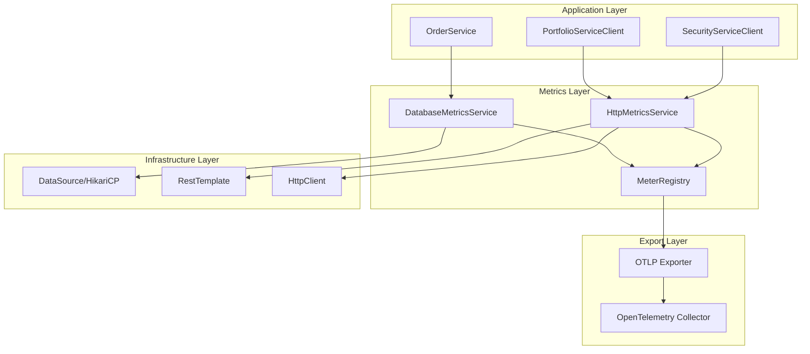

# Design Document

## Overview

This design implements comprehensive custom OpenTelemetry metrics for the GlobeCo Order Service to provide detailed observability into database connection pool performance and HTTP client connection pool behavior. The solution leverages Spring Boot's existing Micrometer integration with OpenTelemetry to create custom metrics that seamlessly integrate with the current monitoring infrastructure.

The design follows a layered approach where metrics collection is abstracted into dedicated service components that can be easily injected into existing services without modifying business logic. All metrics will be automatically exported via the existing OTLP configuration to the OpenTelemetry Collector.

## Architecture

### Component Overview



### Metrics Collection Strategy

1. **Database Metrics**: Utilize HikariCP's built-in metrics and JMX beans to collect connection pool statistics
2. **HTTP Metrics**: Intercept RestTemplate calls and monitor underlying HTTP connection pool via Apache HttpClient metrics
3. **Automatic Registration**: Use Spring's `@EventListener` and `@PostConstruct` to automatically register metrics on application startup
4. **Non-intrusive Design**: Metrics collection happens transparently without modifying existing business logic

## Components and Interfaces

### 1. DatabaseMetricsService

**Purpose**: Collects and exposes database connection pool metrics from HikariCP

**Key Responsibilities**:
- Monitor connection acquisition duration
- Track pool exhaustion events
- Monitor connection acquisition failures
- Expose current pool state (total, active, idle connections)

**Implementation Approach**:
- Use HikariCP's `HikariPoolMXBean` for real-time pool statistics
- Implement custom `ConnectionPoolMetricsTracker` to capture acquisition timing
- Register metrics with Micrometer's `MeterRegistry`

### 2. HttpMetricsService

**Purpose**: Collects and exposes HTTP client connection pool metrics

**Key Responsibilities**:
- Monitor HTTP connection pool utilization
- Track connections by protocol (http/https)
- Expose pool state for external service clients

**Implementation Approach**:
- Configure RestTemplate with `PoolingHttpClientConnectionManager`
- Use Apache HttpClient's pool statistics
- Create custom interceptors to capture connection metrics

### 3. MetricsConfiguration

**Purpose**: Central configuration for all custom metrics

**Key Responsibilities**:
- Register all custom metrics with MeterRegistry
- Configure metric naming and labeling
- Ensure proper resource cleanup

### 4. Custom Metric Definitions

#### Database Metrics
```java
// Histogram for connection acquisition duration
Timer.Sample acquisitionTimer = Timer.start(meterRegistry);
// ... connection acquisition logic
acquisitionTimer.stop(Timer.builder("db_connection_acquisition_duration_seconds")
    .description("Time taken to acquire a database connection")
    .register(meterRegistry));

// Counter for pool exhaustion events
Counter.builder("db_pool_exhaustion_events_total")
    .description("Number of times the database pool reached capacity")
    .register(meterRegistry);

// Counter for acquisition failures
Counter.builder("db_connection_acquisition_failures_total")
    .description("Failed attempts to acquire a database connection")
    .register(meterRegistry);

// Gauges for pool state
Gauge.builder("db_pool_connections_total")
    .description("Maximum connections the pool can handle")
    .register(meterRegistry, hikariDataSource, ds -> ds.getHikariPoolMXBean().getMaximumPoolSize());
```

#### HTTP Metrics
```java
// Gauges for HTTP connection pool state
Gauge.builder("http_pool_connections_total")
    .description("Maximum HTTP connections allowed")
    .tag("protocol", "http")
    .register(meterRegistry, connectionManager, cm -> cm.getMaxTotal());

Gauge.builder("http_pool_connections_active")
    .description("Currently active HTTP connections")
    .tag("protocol", "http")
    .register(meterRegistry, connectionManager, cm -> cm.getTotalStats().getLeased());
```

## Data Models

### Metric Data Structures

#### DatabasePoolMetrics
```java
public class DatabasePoolMetrics {
    private final HikariDataSource dataSource;
    private final MeterRegistry meterRegistry;
    private final Timer acquisitionTimer;
    private final Counter exhaustionCounter;
    private final Counter failureCounter;
    
    // Gauge suppliers for real-time metrics
    private final Supplier<Number> totalConnections;
    private final Supplier<Number> activeConnections;
    private final Supplier<Number> idleConnections;
}
```

#### HttpPoolMetrics
```java
public class HttpPoolMetrics {
    private final PoolingHttpClientConnectionManager connectionManager;
    private final MeterRegistry meterRegistry;
    private final Map<String, Gauge> protocolGauges;
    
    // Protocol-specific metrics
    private final Supplier<Number> httpTotalConnections;
    private final Supplier<Number> httpActiveConnections;
    private final Supplier<Number> httpIdleConnections;
}
```

### Configuration Properties

```properties
# Custom metrics configuration
metrics.database.enabled=true
metrics.http.enabled=true
metrics.collection.interval=30s

# HTTP connection pool configuration for metrics
http.pool.max-total=200
http.pool.max-per-route=20
http.pool.connection-timeout=5000
http.pool.socket-timeout=5000
```

## Error Handling

### Database Metrics Error Handling

1. **HikariCP Unavailable**: Gracefully handle cases where HikariCP MXBean is not available
2. **JMX Access Errors**: Log warnings and continue operation if JMX beans cannot be accessed
3. **Metric Registration Failures**: Catch and log metric registration errors without failing application startup

```java
@PostConstruct
public void initializeDatabaseMetrics() {
    try {
        registerDatabaseMetrics();
        logger.info("Database metrics successfully registered");
    } catch (Exception e) {
        logger.warn("Failed to register database metrics: {}", e.getMessage());
        // Continue application startup
    }
}
```

### HTTP Metrics Error Handling

1. **Connection Manager Access**: Handle cases where connection manager statistics are unavailable
2. **Protocol Detection**: Safely determine protocol type with fallback to "unknown"
3. **Service Client Failures**: Ensure metrics collection doesn't interfere with service client functionality

```java
private void safelyCollectHttpMetrics() {
    try {
        collectConnectionPoolMetrics();
    } catch (Exception e) {
        logger.debug("HTTP metrics collection failed: {}", e.getMessage());
        // Don't propagate errors to business logic
    }
}
```

## Testing Strategy

### Unit Testing

1. **Metrics Service Tests**
   - Test metric registration and collection
   - Verify correct metric values under various conditions
   - Test error handling scenarios

2. **Integration Tests**
   - Verify metrics are properly exported via OTLP
   - Test metric collection during actual database operations
   - Validate HTTP metrics during service client calls

3. **Mock Testing**
   - Mock HikariCP MXBean for database metrics testing
   - Mock HTTP connection manager for HTTP metrics testing
   - Test metric collection with simulated pool states

### Test Implementation Examples

```java
@Test
public void testDatabaseConnectionAcquisitionMetrics() {
    // Given
    DatabaseMetricsService metricsService = new DatabaseMetricsService(meterRegistry, dataSource);
    
    // When
    performDatabaseOperation();
    
    // Then
    Timer acquisitionTimer = meterRegistry.find("db_connection_acquisition_duration_seconds").timer();
    assertThat(acquisitionTimer.count()).isGreaterThan(0);
    assertThat(acquisitionTimer.totalTime(TimeUnit.SECONDS)).isGreaterThan(0);
}

@Test
public void testHttpConnectionPoolMetrics() {
    // Given
    HttpMetricsService metricsService = new HttpMetricsService(meterRegistry, restTemplate);
    
    // When
    portfolioServiceClient.getPortfolioByPortfolioId("test-id");
    
    // Then
    Gauge activeConnections = meterRegistry.find("http_pool_connections_active")
        .tag("protocol", "http")
        .gauge();
    assertThat(activeConnections.value()).isGreaterThanOrEqualTo(0);
}
```

### Performance Testing

1. **Metrics Overhead**: Measure performance impact of metrics collection
2. **Memory Usage**: Monitor memory consumption of metric storage
3. **Export Performance**: Test OTLP export performance under load

### Integration Testing with OpenTelemetry

1. **End-to-End Metrics Flow**: Verify metrics reach OpenTelemetry Collector
2. **Metric Format Validation**: Ensure metrics conform to Prometheus naming conventions
3. **Resource Attribute Verification**: Confirm proper service metadata is included

## Implementation Considerations

### Spring Boot Integration

1. **Auto-Configuration**: Use `@ConditionalOnProperty` to allow enabling/disabling metrics
2. **Bean Lifecycle**: Properly manage metric registration during application startup
3. **Configuration Properties**: Leverage Spring Boot's configuration binding for metric settings

### Performance Optimization

1. **Lazy Initialization**: Initialize metrics only when first accessed
2. **Caching**: Cache metric instances to avoid repeated lookups
3. **Sampling**: Consider sampling for high-frequency metrics if needed

### Monitoring and Alerting

1. **Metric Naming**: Follow Prometheus conventions for consistent dashboards
2. **Label Strategy**: Use consistent labeling for effective querying
3. **Documentation**: Provide metric descriptions for monitoring team

This design ensures that custom OpenTelemetry metrics are seamlessly integrated into the existing GlobeCo Order Service while maintaining high performance and reliability standards.