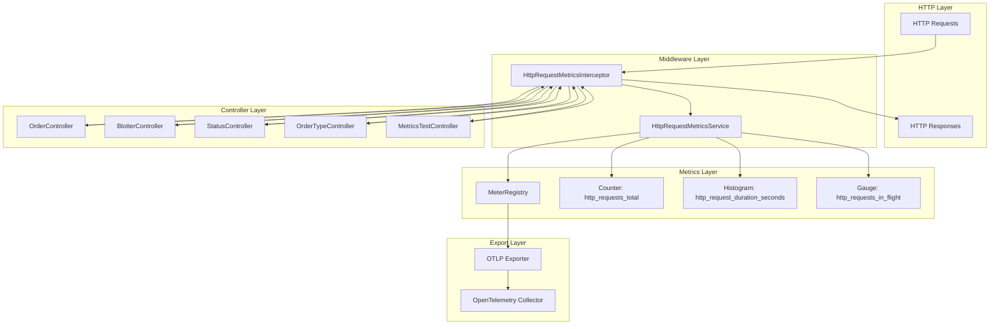

# Design Document

## Overview

This design implements standardized HTTP request metrics for the GlobeCo Order Service following the microservices HTTP metrics requirements specification. The solution leverages Spring Boot's existing Micrometer integration with OpenTelemetry to create HTTP request metrics that seamlessly integrate with the current monitoring infrastructure.

The design follows a middleware-based approach using Spring's HandlerInterceptor to capture all HTTP requests transparently without modifying existing controller logic. All metrics will be automatically exported via the existing OTLP configuration to the OpenTelemetry Collector.

## Architecture

### Component Overview



### Metrics Collection Strategy

1. **Interceptor-Based Collection**: Use Spring's HandlerInterceptor to capture all HTTP requests before they reach controllers and after responses are generated
2. **Timing Accuracy**: Start timing in `preHandle` and stop in `afterCompletion` to capture full request processing time
3. **Route Pattern Extraction**: Use Spring's HandlerMapping to extract route patterns instead of actual URLs with parameters
4. **Thread-Safe Metrics**: Use Micrometer's thread-safe metric implementations for concurrent request handling
5. **Error Resilience**: Ensure metrics collection failures don't impact request processing

## Components and Interfaces

### 1. HttpRequestMetricsInterceptor

**Purpose**: Intercepts all HTTP requests to collect timing and request information

**Key Responsibilities**:
- Start timing when request processing begins
- Extract HTTP method, route pattern, and other request metadata
- Increment in-flight requests gauge
- Stop timing and record metrics when request processing completes
- Handle exceptions gracefully without impacting request processing

**Implementation Approach**:
- Implement Spring's `HandlerInterceptor` interface
- Use `ThreadLocal` to store timing information across interceptor methods
- Extract route patterns from `HandlerMapping` information
- Register with Spring's `InterceptorRegistry`

### 2. HttpRequestMetricsService

**Purpose**: Manages HTTP request metrics registration and recording

**Key Responsibilities**:
- Register HTTP request metrics with MeterRegistry
- Provide thread-safe methods for recording metrics
- Handle metric naming and labeling according to requirements
- Provide utility methods for route pattern sanitization

**Implementation Approach**:
- Use Micrometer's Counter, Timer, and Gauge implementations
- Implement route pattern sanitization to avoid high cardinality
- Provide methods for safe metric recording with error handling

### 3. HttpRequestMetricsConfiguration

**Purpose**: Configuration class for HTTP request metrics setup

**Key Responsibilities**:
- Register the HttpRequestMetricsInterceptor with Spring
- Configure metric properties and settings
- Integrate with existing MetricsConfiguration
- Provide conditional enablement based on properties

### 4. Metric Definitions

#### HTTP Requests Total Counter
```java
Counter httpRequestsTotal = Counter.builder("http_requests_total")
    .description("Total number of HTTP requests")
    .tag("method", httpMethod)
    .tag("path", routePattern)
    .tag("status", statusCode)
    .register(meterRegistry);
```

#### HTTP Request Duration Histogram
```java
Timer httpRequestDuration = Timer.builder("http_request_duration_seconds")
    .description("Duration of HTTP requests in seconds")
    .tag("method", httpMethod)
    .tag("path", routePattern)
    .tag("status", statusCode)
    .publishPercentileHistogram()
    .serviceLevelObjectives(
        Duration.ofMillis(5),   // 0.005s
        Duration.ofMillis(10),  // 0.01s
        Duration.ofMillis(25),  // 0.025s
        Duration.ofMillis(50),  // 0.05s
        Duration.ofMillis(100), // 0.1s
        Duration.ofMillis(250), // 0.25s
        Duration.ofMillis(500), // 0.5s
        Duration.ofSeconds(1),  // 1s
        Duration.ofMillis(2500), // 2.5s
        Duration.ofSeconds(5),  // 5s
        Duration.ofSeconds(10)  // 10s
    )
    .register(meterRegistry);
```

#### HTTP Requests In Flight Gauge
```java
AtomicInteger inFlightRequests = new AtomicInteger(0);
Gauge httpRequestsInFlight = Gauge.builder("http_requests_in_flight")
    .description("Number of HTTP requests currently being processed")
    .register(meterRegistry, inFlightRequests, AtomicInteger::get);
```

## Data Models

### Request Timing Context
```java
public class RequestTimingContext {
    private final long startTime;
    private final String method;
    private final String path;
    private final AtomicInteger inFlightCounter;
    
    public RequestTimingContext(String method, String path, AtomicInteger inFlightCounter) {
        this.startTime = System.nanoTime();
        this.method = method;
        this.path = path;
        this.inFlightCounter = inFlightCounter;
        this.inFlightCounter.incrementAndGet();
    }
    
    public void complete(int statusCode, HttpRequestMetricsService metricsService) {
        long duration = System.nanoTime() - startTime;
        inFlightCounter.decrementAndGet();
        metricsService.recordRequest(method, path, statusCode, duration);
    }
}
```

### Route Pattern Sanitizer
```java
public class RoutePatternSanitizer {
    private static final Pattern PATH_VARIABLE_PATTERN = Pattern.compile("\\{[^}]+\\}");
    private static final int MAX_PATH_SEGMENTS = 10;
    
    public static String sanitizeRoutePath(String path) {
        if (path == null || path.isEmpty()) {
            return "/unknown";
        }
        
        // Remove query parameters
        int queryIndex = path.indexOf('?');
        if (queryIndex > 0) {
            path = path.substring(0, queryIndex);
        }
        
        // Limit path segments to prevent high cardinality
        String[] segments = path.split("/");
        if (segments.length > MAX_PATH_SEGMENTS) {
            return String.join("/", Arrays.copyOf(segments, MAX_PATH_SEGMENTS)) + "/...";
        }
        
        return path;
    }
}
```

## Error Handling

### Interceptor Error Handling

1. **Timing Failures**: If timing fails, log error but continue request processing
2. **Metric Recording Failures**: Catch and log metric recording errors without propagating
3. **Route Pattern Extraction Failures**: Use fallback patterns when route extraction fails
4. **Thread Safety**: Ensure ThreadLocal cleanup in finally blocks

```java
@Override
public boolean preHandle(HttpServletRequest request, HttpServletResponse response, Object handler) {
    try {
        String method = request.getMethod();
        String path = extractRoutePath(request, handler);
        
        RequestTimingContext context = new RequestTimingContext(method, path, inFlightRequests);
        REQUEST_CONTEXT.set(context);
        
        return true;
    } catch (Exception e) {
        logger.warn("Failed to start HTTP request metrics collection: {}", e.getMessage());
        return true; // Continue processing even if metrics fail
    }
}

@Override
public void afterCompletion(HttpServletRequest request, HttpServletResponse response, 
                          Object handler, Exception ex) {
    try {
        RequestTimingContext context = REQUEST_CONTEXT.get();
        if (context != null) {
            context.complete(response.getStatus(), metricsService);
        }
    } catch (Exception e) {
        logger.warn("Failed to complete HTTP request metrics collection: {}", e.getMessage());
    } finally {
        REQUEST_CONTEXT.remove(); // Always clean up ThreadLocal
    }
}
```

### Metrics Service Error Handling

1. **Counter Increment Failures**: Log and continue without failing request
2. **Timer Recording Failures**: Use fallback timing if primary timer fails
3. **Gauge Update Failures**: Ensure in-flight counter consistency

```java
public void recordRequest(String method, String path, int statusCode, long durationNanos) {
    try {
        // Record counter
        getOrCreateCounter(method, path, String.valueOf(statusCode)).increment();
        
        // Record duration
        getOrCreateTimer(method, path, String.valueOf(statusCode))
            .record(durationNanos, TimeUnit.NANOSECONDS);
            
    } catch (Exception e) {
        logger.warn("Failed to record HTTP request metrics for {} {}: {}", 
                   method, path, e.getMessage());
    }
}
```

## Testing Strategy

### Unit Testing

1. **Interceptor Tests**
   - Test request timing accuracy
   - Verify route pattern extraction
   - Test error handling scenarios
   - Validate ThreadLocal cleanup

2. **Metrics Service Tests**
   - Test metric registration
   - Verify metric recording with various inputs
   - Test route pattern sanitization
   - Test concurrent access scenarios

3. **Integration Tests**
   - Test end-to-end metric collection during actual HTTP requests
   - Verify metrics are exported via OTLP
   - Test with different endpoint types (API, health checks, errors)

### Test Implementation Examples

```java
@Test
public void testHttpRequestMetricsCollection() {
    // Given
    MockHttpServletRequest request = new MockHttpServletRequest("GET", "/api/v1/orders");
    MockHttpServletResponse response = new MockHttpServletResponse();
    response.setStatus(200);
    
    // When
    interceptor.preHandle(request, response, handler);
    // Simulate processing time
    Thread.sleep(10);
    interceptor.afterCompletion(request, response, handler, null);
    
    // Then
    Counter counter = meterRegistry.find("http_requests_total")
        .tag("method", "GET")
        .tag("path", "/api/v1/orders")
        .tag("status", "200")
        .counter();
    assertThat(counter.count()).isEqualTo(1);
    
    Timer timer = meterRegistry.find("http_request_duration_seconds")
        .tag("method", "GET")
        .tag("path", "/api/v1/orders")
        .tag("status", "200")
        .timer();
    assertThat(timer.count()).isEqualTo(1);
    assertThat(timer.totalTime(TimeUnit.MILLISECONDS)).isGreaterThan(5);
}

@Test
public void testInFlightRequestsGauge() {
    // Given
    MockHttpServletRequest request = new MockHttpServletRequest("POST", "/api/v1/orders");
    MockHttpServletResponse response = new MockHttpServletResponse();
    
    // When - Start request
    interceptor.preHandle(request, response, handler);
    
    // Then - In-flight should be incremented
    Gauge inFlightGauge = meterRegistry.find("http_requests_in_flight").gauge();
    assertThat(inFlightGauge.value()).isEqualTo(1);
    
    // When - Complete request
    response.setStatus(201);
    interceptor.afterCompletion(request, response, handler, null);
    
    // Then - In-flight should be decremented
    assertThat(inFlightGauge.value()).isEqualTo(0);
}
```

### Performance Testing

1. **Metrics Overhead**: Measure performance impact of metrics collection on request processing
2. **Memory Usage**: Monitor memory consumption of metric storage under load
3. **Concurrent Requests**: Test metrics accuracy under high concurrent load
4. **Route Pattern Performance**: Test route pattern extraction performance

### Integration Testing with OpenTelemetry

1. **End-to-End Metrics Flow**: Verify metrics reach OpenTelemetry Collector
2. **Metric Format Validation**: Ensure metrics conform to expected format
3. **Label Consistency**: Verify consistent labeling across different request types
4. **Resource Attributes**: Confirm proper service metadata inclusion

## Implementation Considerations

### Spring Boot Integration

1. **Auto-Configuration**: Use `@ConditionalOnProperty` to allow enabling/disabling HTTP request metrics
2. **Interceptor Registration**: Register interceptor with appropriate order to ensure it runs for all requests
3. **Configuration Properties**: Leverage existing metrics configuration properties
4. **Bean Lifecycle**: Ensure proper initialization order with existing metrics infrastructure

### Performance Optimization

1. **Route Pattern Caching**: Cache route patterns to avoid repeated extraction
2. **Metric Instance Caching**: Cache Counter and Timer instances to avoid repeated lookups
3. **ThreadLocal Management**: Efficient ThreadLocal usage with proper cleanup
4. **Sampling**: Consider sampling for very high-frequency endpoints if needed

### Security and Privacy

1. **Path Parameter Sanitization**: Replace path parameters with generic placeholders
2. **Sensitive Data Filtering**: Avoid capturing sensitive information in labels
3. **Cardinality Control**: Limit unique label combinations to prevent metric explosion
4. **Query Parameter Exclusion**: Never include query parameters in path labels

### Monitoring and Alerting

1. **Metric Naming**: Follow Prometheus conventions for dashboard compatibility
2. **Label Strategy**: Use consistent labeling for effective querying and alerting
3. **Documentation**: Provide clear metric descriptions for monitoring teams
4. **Dashboard Templates**: Consider providing Grafana dashboard templates

This design ensures that HTTP request metrics are comprehensively captured while maintaining high performance and reliability standards, integrating seamlessly with the existing GlobeCo Order Service monitoring infrastructure.