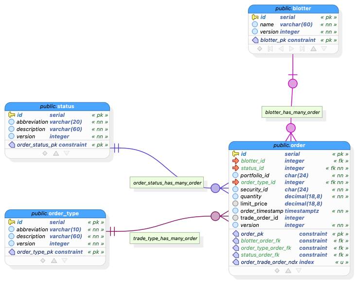

# GlobeCo Order Service Requirements

## Background

This document provides a comprehensive data dictionary and model documentation for the Order Service database. The database is designed to manage trading orders within a financial system, including order management, order types, status tracking, and organization via blotters.


## Technology


## Data Dictionary


[Data Dictionary](order-service.html)

## Entity Relationship Diagram




```
+-------------+       +----------------+       +-------------+
|   blotter   |       |     order      |       | order_type  |
+-------------+       +----------------+       +-------------+
| PK id       |<----->| PK id          |<----->| PK id       |
|    name     |       |    blotter_id  |       |    abbrev.  |
|    version  |       |    status_id   |       |    desc.    |
+-------------+       |    portfolio_id|       |    version  |
                      |    order_type_id|      +-------------+
                      |    security_id |
                      |    quantity    |       +-------------+
                      |    limit_price |       |   status    |
                      |    order_time  |<----->| PK id       |
                      |    version     |       |    abbrev.  |
                      +----------------+       |    desc.    |
                                               |    version  |
                                               +-------------+
```

## Tables

### blotter

A blotter is a record of financial transactions, typically used to organize and group orders.

| Column  | Data Type   | Constraints    | Description                       |
|---------|-------------|----------------|-----------------------------------|
| id      | serial      | PK, NOT NULL   | Unique identifier                 |
| name    | varchar(60) | NOT NULL       | Name of the blotter               |
| version | integer     | NOT NULL, DEF 1 | Optimistic locking version number |

### order

The main entity representing a trading order in the system.

| Column          | Data Type     | Constraints        | Description                            |
|-----------------|---------------|-------------------|----------------------------------------|
| id              | serial        | PK, NOT NULL      | Unique identifier                      |
| blotter_id      | integer       | FK to blotter.id  | Reference to the containing blotter    |
| status_id       | integer       | FK, NOT NULL      | Reference to order status              |
| portfolio_id    | char(24)      | NOT NULL          | ID of the portfolio making the order   |
| order_type_id   | integer       | FK, NOT NULL      | Reference to order type                |
| security_id     | char(24)      | NOT NULL          | ID of the security being traded        |
| quantity        | decimal(18,8) | NOT NULL          | Amount of security to trade            |
| limit_price     | decimal(18,8) |                   | Price limit for the order (if applicable) |
| order_timestamp | timestamptz   | NOT NULL, DEF NOW | When the order was placed              |
| version         | integer       | NOT NULL, DEF 1   | Optimistic locking version number      |

### order_type

Defines the various types of orders available in the system.

| Column       | Data Type   | Constraints    | Description                       |
|-------------|-------------|----------------|-----------------------------------|
| id          | serial      | PK, NOT NULL   | Unique identifier                 |
| abbreviation | varchar(10) | NOT NULL       | Short code for the order type     |
| description | varchar(60) | NOT NULL       | Detailed description of order type |
| version     | integer     | NOT NULL, DEF 1 | Optimistic locking version number |

### status

Defines the possible statuses an order can have.

| Column       | Data Type   | Constraints    | Description                       |
|-------------|-------------|----------------|-----------------------------------|
| id          | serial      | PK, NOT NULL   | Unique identifier                 |
| abbreviation | varchar(20) | NOT NULL       | Short code for the status         |
| description | varchar(60) | NOT NULL       | Detailed description of status    |
| version     | integer     | NOT NULL, DEF 1 | Optimistic locking version number |

## Relationships

1. **blotter to order (1:N)**
   - A blotter can contain multiple orders
   - An order can optionally belong to one blotter
   - If a blotter is deleted, the blotter_id in associated orders is set to NULL

2. **order_type to order (1:N)**
   - An order type can be used by multiple orders
   - Each order must have exactly one order type
   - Order types cannot be deleted if they're referenced by orders

3. **status to order (1:N)**
   - A status can apply to multiple orders
   - Each order must have exactly one status
   - Status records cannot be deleted if they're referenced by orders

## Design Notes

1. The database uses PostgreSQL version 17.0
2. All tables include a version column for optimistic locking
3. The model uses 24-character strings for external IDs (portfolio_id, security_id), likely to accommodate MongoDB ObjectIDs
4. Decimal columns use high precision (18,8) to accommodate financial calculations
5. Orders have ON DELETE RESTRICT for status and order_type relationships, preventing deletion of referenced records
6. All timestamp fields use timestamptz (timestamp with time zone) to ensure proper timezone handling


## Data Transfer Objects (DTOs)

The following DTOs represent the data structures used to transfer information between the API and clients for the main entities in the GlobeCo Order Service.

---

### BlotterDTO for GET and PUT

Represents a blotter, which is a record grouping financial transactions.

| Field   | Type    | Nullable | Description                                 |
|---------|---------|----------|---------------------------------------------|
| id      | Integer | No       | Unique identifier for the blotter           |
| name    | String  | No       | Name of the blotter                         |
| version | Integer | No       | Optimistic locking version number           |

---
### BlotterDTO for POST

Represents a blotter, which is a record grouping financial transactions.

| Field   | Type    | Nullable | Description                                 |
|---------|---------|----------|---------------------------------------------|
| name    | String  | No       | Name of the blotter                         |
| version | Integer | No       | Optimistic locking version number           |

---

### OrderTypeDTO for GET and PUT

Represents the type of an order.

| Field         | Type    | Nullable | Description                                 |
|---------------|---------|----------|---------------------------------------------|
| id            | Integer | No       | Unique identifier for the order type        |
| abbreviation  | String  | No       | Short code for the order type               |
| description   | String  | No       | Detailed description of the order type      |
| version       | Integer | No       | Optimistic locking version number           |

---

### OrderTypeDTO for POST

Represents the type of an order.

| Field         | Type    | Nullable | Description                                 |
|---------------|---------|----------|---------------------------------------------|
| abbreviation  | String  | No       | Short code for the order type               |
| description   | String  | No       | Detailed description of the order type      |
| version       | Integer | No       | Optimistic locking version number           |

---


### StatusDTO for GET and PUT

Represents the status of an order.

| Field         | Type    | Nullable | Description                                 |
|---------------|---------|----------|---------------------------------------------|
| id            | Integer | No       | Unique identifier for the status            |
| abbreviation  | String  | No       | Short code for the status                   |
| description   | String  | No       | Detailed description of the status          |
| version       | Integer | No       | Optimistic locking version number           |

---

### StatusDTO for POST

Represents the status of an order.

| Field         | Type    | Nullable | Description                                 |
|---------------|---------|----------|---------------------------------------------|
| abbreviation  | String  | No       | Short code for the status                   |
| description   | String  | No       | Detailed description of the status          |
| version       | Integer | No       | Optimistic locking version number           |

---


### OrderDTO for PUT

Represents a trading order in the system.

| Field           | Type             | Nullable | Description                                         |
|-----------------|------------------|----------|-----------------------------------------------------|
| id              | Integer          | No       | Unique identifier for the order                     |
| blotterId       | Integer          | Yes      | Reference to the containing blotter                 |
| statusId        | Integer          | No       | Reference to the order status                       |
| portfolioId     | String (24 char) | No       | ID of the portfolio making the order                |
| orderTypeId     | Integer          | No       | Reference to the order type                         |
| securityId      | String (24 char) | No       | ID of the security being traded                     |
| quantity        | Decimal(18,8)    | No       | Amount of security to trade                         |
| limitPrice      | Decimal(18,8)    | Yes      | Price limit for the order (if applicable)           |
| orderTimestamp  | OffsetDateTime   | No       | When the order was placed                           |
| version         | Integer          | No       | Optimistic locking version number                   |

---


### OrderDTO for POST

Represents a trading order in the system.

| Field           | Type             | Nullable | Description                                         |
|-----------------|------------------|----------|-----------------------------------------------------|
| id              | Integer          | No       | Unique identifier for the order                     |
| blotterId       | Integer          | Yes      | Reference to the containing blotter                 |
| statusId        | Integer          | No       | Reference to the order status                       |
| portfolioId     | String (24 char) | No       | ID of the portfolio making the order                |
| orderTypeId     | Integer          | No       | Reference to the order type                         |
| securityId      | String (24 char) | No       | ID of the security being traded                     |
| quantity        | Decimal(18,8)    | No       | Amount of security to trade                         |
| limitPrice      | Decimal(18,8)    | Yes      | Price limit for the order (if applicable)           |
| orderTimestamp  | OffsetDateTime   | No       | When the order was placed                           |
| version         | Integer          | No       | Optimistic locking version number                   |

---


### OrderWithDetailsDTO for GET

Represents a trading order in the system, including detailed information about its associated blotter, status, and order type.

| Field           | Type                | Nullable | Description                                         |
|-----------------|---------------------|----------|-----------------------------------------------------|
| id              | Integer             | No       | Unique identifier for the order                     |
| blotter         | BlotterDTO          | Yes      | The containing blotter (see [BlotterDTO](#blotterdto)) |
| status          | StatusDTO           | No       | The order status (see [StatusDTO](#statusdto))      |
| portfolioId     | String (24 char)    | No       | ID of the portfolio making the order                |
| orderType       | OrderTypeDTO        | No       | The order type (see [OrderTypeDTO](#ordertypedto))  |
| securityId      | String (24 char)    | No       | ID of the security being traded                     |
| quantity        | Decimal(18,8)       | No       | Amount of security to trade                         |
| limitPrice      | Decimal(18,8)       | Yes      | Price limit for the order (if applicable)           |
| orderTimestamp  | OffsetDateTime      | No       | When the order was placed                           |
| version         | Integer             | No       | Optimistic locking version number                   |


#### Nested DTOs

##### BlotterDTO

| Field   | Type    | Nullable | Description                                 |
|---------|---------|----------|---------------------------------------------|
| id      | Integer | No       | Unique identifier for the blotter           |
| name    | String  | No       | Name of the blotter                         |
| version | Integer | No       | Optimistic locking version number           |

##### StatusDTO

| Field         | Type    | Nullable | Description                                 |
|---------------|---------|----------|---------------------------------------------|
| id            | Integer | No       | Unique identifier for the status            |
| abbreviation  | String  | No       | Short code for the status                   |
| description   | String  | No       | Detailed description of the status          |
| version       | Integer | No       | Optimistic locking version number           |

##### OrderTypeDTO

| Field         | Type    | Nullable | Description                                 |
|---------------|---------|----------|---------------------------------------------|
| id            | Integer | No       | Unique identifier for the order type        |
| abbreviation  | String  | No       | Short code for the order type               |
| description   | String  | No       | Detailed description of the order type      |
| version       | Integer | No       | Optimistic locking version number           |

---


**Notes:**
- All DTOs use types that match the database schema.
- Foreign keys are represented as IDs.
- Nullable fields are indicated in the table.
- The `OrderWithDetailsDTO` provides a richer representation for API responses, embedding related entities directly.
- For lists of orders, you may return a list of `OrderWithDetailsDTO` objects.

